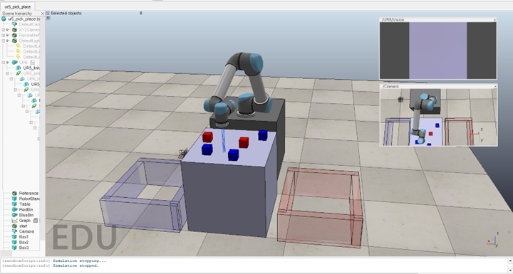
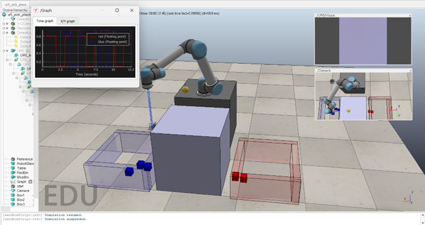

# Pick and Place Robot (6-DOF Robot)

This project implements a **Pick and Place Robot** using a **UR5 robotic arm** in CoppeliaSim. The robot is programmed to identify, pick, and place colored boxes (red and blue) into designated areas using a **finite state machine (FSM)** for control. The project showcases the integration of sensors, inverse kinematics, and state-based logic for precise robotic operations.

---

  
  

## Features
- **UR5 Robotic Arm**:
  - Controls the motion of the manipulator to pick and place objects.
- **Color Detection**:
  - Proximity and vision sensors detect objects and differentiate between red and blue boxes.
- **Finite State Machine (FSM)**:
  - Manages operational states, ensuring smooth transitions between detecting, picking, moving, and placing objects.
- **Robust Control**:
  - Implements inverse kinematics for precise movement and collision avoidance.

---

## System Overview
### Components:
1. **UR5 Robotic Arm**: The primary manipulator.
2. **Colored Boxes**: Red and blue boxes to be sorted into designated areas.
3. **Proximity and Vision Sensors**: Detects object presence and identifies their colors.
4. **Finite State Machine (FSM)**: Controls the sequence of operations:
   - Detecting objects.
   - Moving to object positions.
   - Grasping and releasing objects.

---

## Workflow
### 1. **Initialization (`sysCall_init`)**:
- Handles for the UR5 arm, end effector, sensors, and objects are initialized.
- A list of all boxes in the scene is created (`objects_to_move`).
- The initial positions for picking and placing boxes are calculated.
- FSM states are defined.

### 2. **Actuation (`sysCall_actuation`)**:
- Called at each simulation step.
- Retrieves the current box to be processed.
- Adjusts box positions for collision-free grasping.
- Updates the robotic arm's state using the `moveSimpleManipulator` function.

### 3. **FSM Logic (`moveSimpleManipulator`)**:
- Core state transitions and actions:
  - `state_start`: Initialization phase.
  - `state_start2pick`: Moves towards the box.
  - `state_pick`: Grasps the box.
  - `state_pick2start`: Returns to the start position.
  - `state_place`: Releases the box in its designated area.
  - `state_stop`: Ends the operation.
- Utilizes the `moveIK` function to control the arm’s motion using inverse kinematics.

### 4. **Inverse Kinematics (`moveIK`)**:
- Computes positions based on the current and target positions.
- Interpolates movement over a specified duration.

### 5. **Object Handling (`graspObject` and `releaseObject`)**:
- **Grasping**:
  - Uses the vision sensor to identify and pick up boxes based on color detection.
  - Sets flags (`is_red`) for color-based sorting.
- **Releasing**:
  - Updates the parent of the attached shape to release the object in the correct area.

---

## Implementation in CoppeliaSim
### 1. **Scene Setup**:
- Insert a **UR5 robotic arm** model into a new CoppeliaSim scene.
- Add red and blue boxes at various positions.
- Set up proximity and vision sensors.

### 2. **Attach Script**:
- Attach the provided Lua script to the UR5 arm. The script includes control logic for picking and placing.

### 3. **Configure Sensors**:
- Ensure the vision sensor outputs color data to distinguish red and blue boxes.

### 4. **Run and Test**:
- Start the simulation to observe the arm detecting, picking, and placing boxes:
  - Red boxes → Right area.
  - Blue boxes → Left area.

### 5. **Debugging**:
- Adjust sensor configurations or FSM parameters (e.g., durations) for smooth operation.

---

## Results
1. **Initial State**:
   - The arm starts at its default position, ready to operate.
2. **Detect Blue Box**:
   - Identifies and picks up the blue box, placing it in the left area.
3. **Detect Red Box**:
   - Identifies and picks up the red box, placing it in the right area.
4. **Final Sorted State**:
   - All boxes are sorted into their designated areas.

---

## Usage
1. **Set Up**:
   - Open the CoppeliaSim scene with the UR5 arm and colored boxes.
2. **Attach Script**:
   - Link the provided Lua script to the UR5 model.
3. **Run Simulation**:
   - Start the simulation and observe the pick-and-place operation.

---
